# EmergenceOS Architecture Diagram

EmergenceOS is an **event-driven operating system for AI agents**. The kernel is deterministic and never calls LLMs; intelligence lives in **plugins** — long-lived processes coordinated via mailboxes, events, capability-gated services, and a priority scheduler.

---

## 1. Layered System Overview

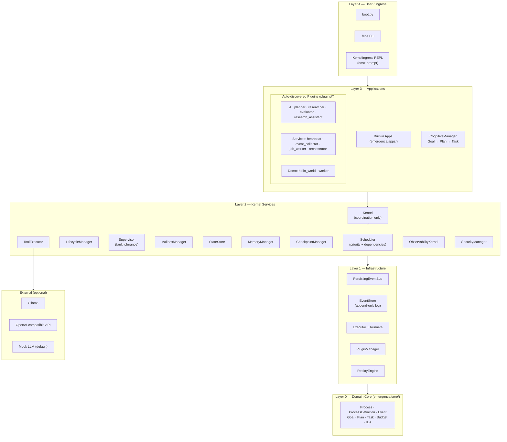

**Dependency rule:** `core/` has zero infrastructure imports. Everything else depends inward on `core/`.

---

## 2. Kernel Internals & Composition Root

All services are wired in `create_kernel_context()` — the single composition root:

```mermaid
flowchart LR
    subgraph Boot["boot.py / eos serve"]
        BC["create_kernel_context()"]
        BK["build_kernel() / build_runtime()"]
    end

    subgraph KernelContext["KernelContext"]
        direction TB
        EB2["PersistingEventBus ← EventStore"]
        CAP["CapabilityManager → SecurityManager"]
        SCH2["Scheduler"]
        ST["StateStore"]
        PT["ProcessTable"]
        REG["ProcessRegistry"]
        MB["MailboxManager"]
        MEM2["MemoryManager ← MemoryStore"]
        CHK["CheckpointManager"]
        EXE2["Executor"]
        TOOLS["ToolExecutor ← ToolRegistry"]
        OBS2["ObservabilityKernel"]
        COG2["CognitiveManager"]
        PLG["PluginManager"]
    end

    subgraph Runtime["Runtime Objects"]
        K2["Kernel"]
        LCM2["LifecycleManager"]
        SUP2["Supervisor"]
        ING["KernelIngress REPL"]
    end

    BC --> KernelContext
    BK --> K2
    KernelContext --> K2
    K2 --> LCM2
    K2 --> SUP2
    K2 --> ING
```

---

## 3. Process Execution Lifecycle

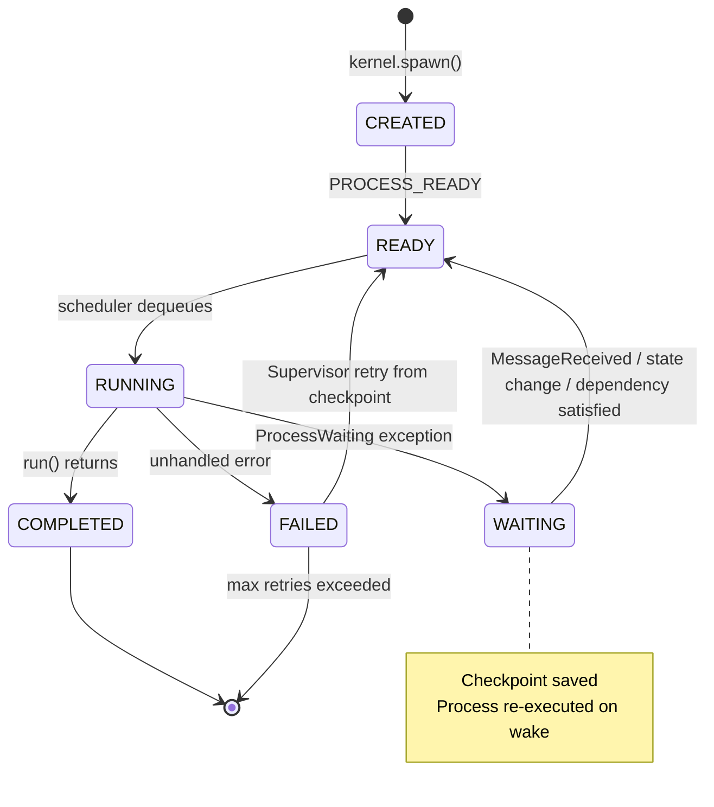

**Execution pipeline:**

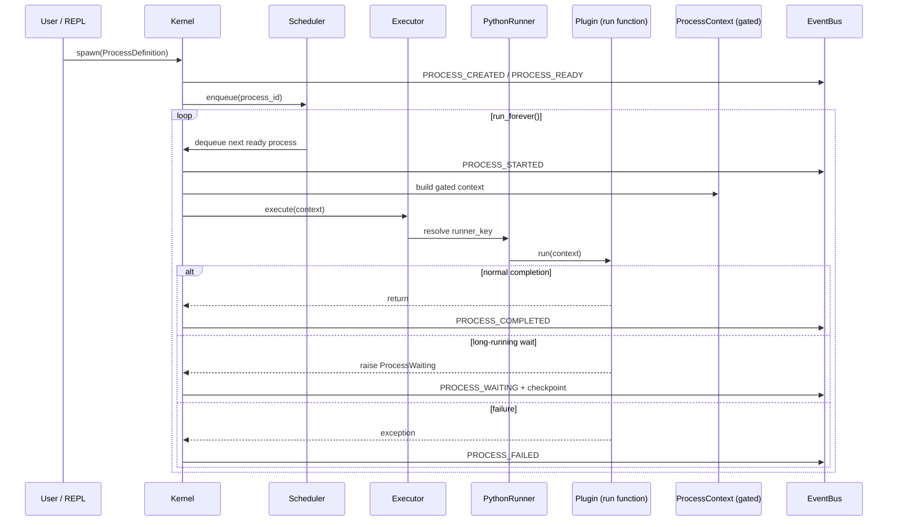

---

## 4. Communication Patterns

Processes **never call each other directly**. Two primary channels:

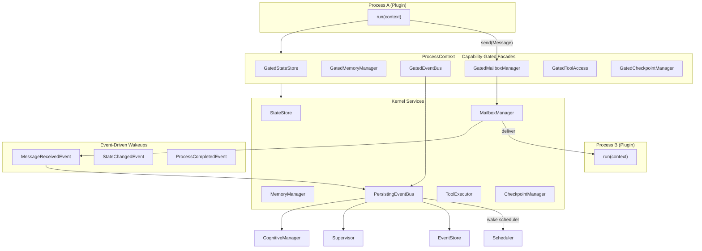

**IPC message types** (`emergence/common/`): `Message`, `Request`, `Response`, `Command`

---

## 5. Security & Capability Model

Every kernel service exposed to a process is wrapped in a **Gated\*** facade. `SecurityManager.require()` enforces capabilities on every operation.

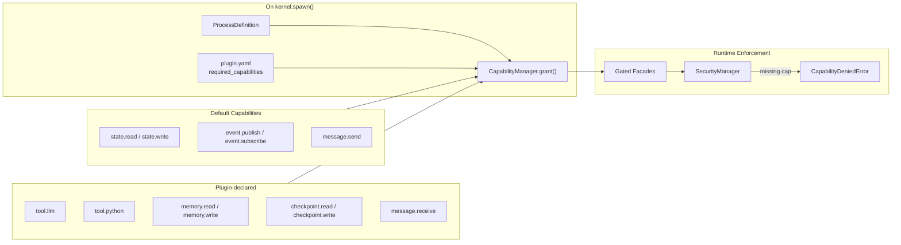

---

## 6. Plugin System

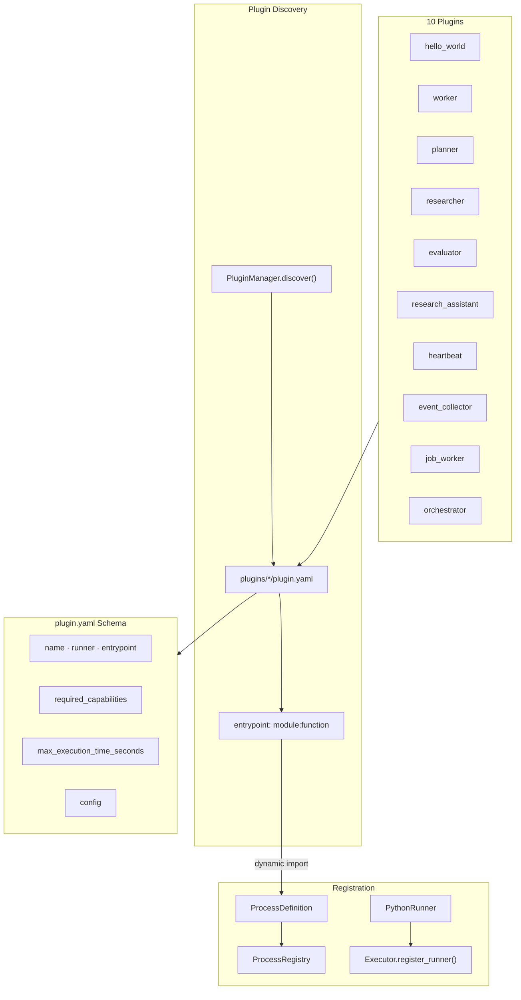

| Plugin | Role | Key capabilities |
|--------|------|-----------------|
| **hello_world** | Demo | `tool.python` |
| **worker** | Cognitive task worker | state |
| **planner** | LLM goal decomposition | `tool.llm`, state |
| **researcher** | LLM research + RAG | `tool.llm`, memory, messages |
| **evaluator** | LLM quality scoring | `tool.llm`, `event.publish` |
| **research_assistant** | End-to-end pipeline | LLM, memory, checkpoint, approval |
| **heartbeat** | Long-running service | memory, checkpoint, messages |
| **event_collector** | Event → episodic memory | memory, messages |
| **job_worker** | Mailbox work queue | memory, messages, `tool.python` |
| **orchestrator** | Multi-service coordinator | memory, state, messages |

---

## 7. Tool Invocation & LLM Boundary

The kernel **never** calls an LLM. Plugins invoke tools via `context.tools.invoke()`:

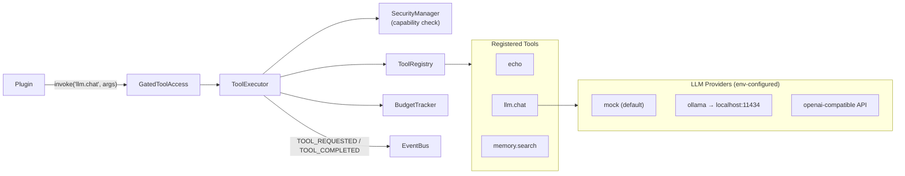

**Environment variables:** `EMERGENCE_LLM_PROVIDER`, `EMERGENCE_LLM_MODEL`, `EMERGENCE_LLM_BASE_URL`, `EMERGENCE_LLM_API_KEY`

---

## 8. Cognitive Pipeline

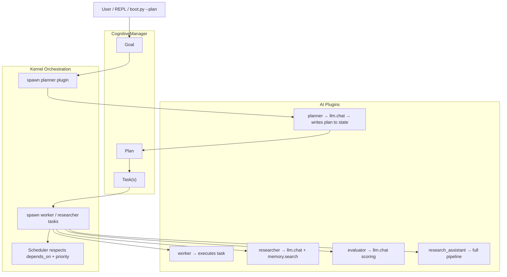

---

## 9. Persistence & Storage Layer

All storage is **in-memory today** (event sourcing foundation for future durability):

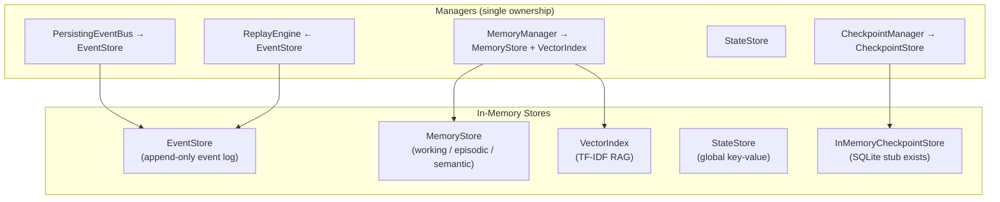

---

## 10. Entry Points & Boot Modes

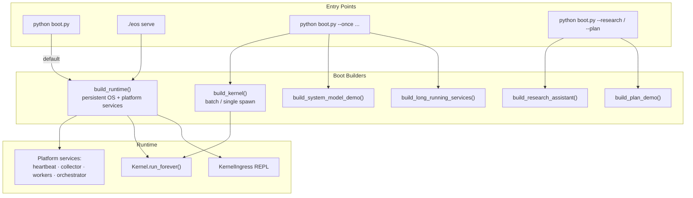

---

## 11. Architectural Invariants

| Invariant | Meaning |
|-----------|---------|
| **Kernel never thinks** | No LLM, planning, or reasoning in kernel code |
| **Single ownership** | Each mutable resource has exactly one manager |
| **Event-driven** | All cross-cutting communication via immutable events |
| **Capability security** | Least privilege on every gated service call |
| **Long-lived processes** | `wait_for_message()` → WAITING → checkpoint → wake → re-execute |
| **Composition root** | `boot_context.create_kernel_context()` is the only wiring point |
| **No direct IPC** | Processes communicate via mailboxes + events, never direct calls |

---

## 12. Repository Map

```
EmergenceOS/
├── boot.py                    # Primary entry point
├── eos                        # CLI wrapper → emergence.cli
├── emergence/
│   ├── core/                  # Domain model (no infra deps)
│   ├── kernel/                # Kernel, boot, mailboxes, lifecycle
│   ├── scheduler/             # Priority queue + dependencies
│   ├── executor/              # Runners + ToolExecutor
│   ├── events/                # EventBus, EventStore, replay
│   ├── security/              # Capabilities + Gated facades
│   ├── memory/                # MemoryManager + TF-IDF vector index
│   ├── checkpoint/            # Process snapshots
│   ├── cognitive/             # Goal → Plan → Task
│   ├── plugins/               # Plugin loader + manager
│   ├── tools/                 # LLM providers + tool registry
│   ├── observability/         # Metrics, tracing, CLI display
│   ├── cli/                   # eos subcommands
│   └── apps/                  # Built-in demos
├── plugins/                   # 10 auto-discovered plugins
├── tests/                     # 486 unit + integration tests
└── docs/                      # Design principles, guides
```

---

See also: [architecture.md](../architecture.md) for design philosophy and principles.
